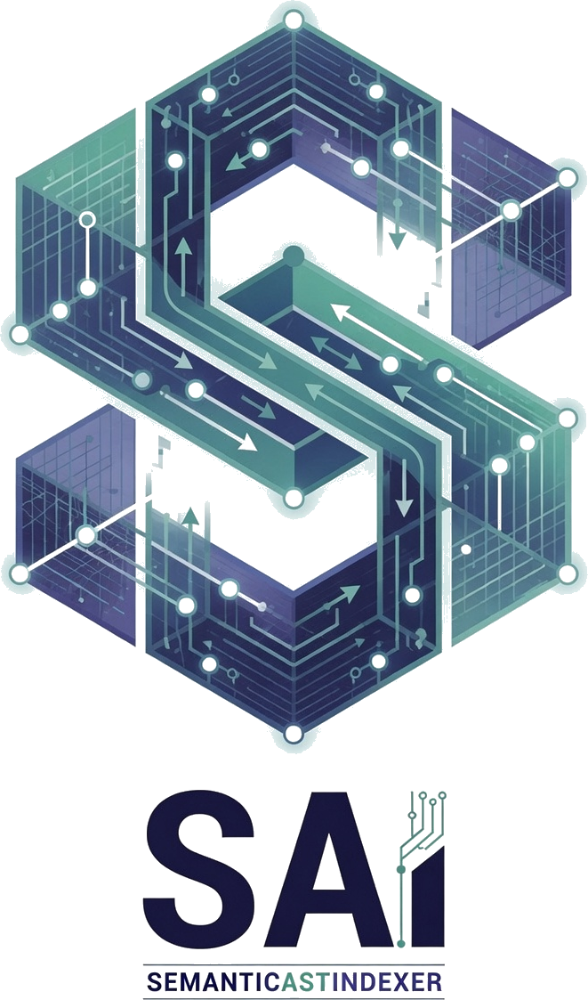

  

# Introduction

**semanticastindexer** (SAI) is a Rust CLI and MCP server for **semantic code search** and **near-duplicate function detection** over any codebase. You index your source once, then you can do two things with it:

- **Search in plain English** — ask "where do we open the DuckDB connection?" and get the matching code, ranked by meaning rather than keywords.
- **Surface near-duplicate functions** — find the functions across the repo that are near-copies of each other, so you can de-duplicate or refactor.

SAI works the same whether you drive it yourself from the terminal or wire it into an AI coding agent as an [MCP](./reference/mcp-server.md) server.

## Highlights

- **Local-first and offline.** Embeddings run **on-device** through ONNX Runtime (via `ort`) — no API keys, nothing leaves your machine. A compact code model is pulled once from Hugging Face (`jina-embeddings-v2-base-code`, or `e5-small`). If you prefer, you can instead point at an [Ollama](./integrations/ollama.md) server over HTTP.
- **Pluggable backends.** Store vectors in a **local DuckDB** file (VSS/HNSW, fully offline) or in **[Qdrant Cloud](./integrations/qdrant-cloud.md)** with server-side inference.
- **Symbol-aware AST chunking.** Code is split per symbol using tree-sitter for **TypeScript/TSX, Rust, and Go**; every other language falls back to a line-based chunker.
- **You control what leaves the repo.** A YAML config filters out tests, generated files, comments, and more, and `sai-noindexing` / `sai-noduplicate` opt-out markers let you exclude code inline.
- **Read-only by default.** The MCP server only searches; the write tool (`sai_refresh`) requires `--allow-write`.

## Who it is for

- **Developers** navigating a large or unfamiliar codebase who want to find code by intent instead of grepping for exact names.
- **Teams fighting duplication** who want to detect copy-pasted or near-identical functions across the whole repo.
- **AI coding agents** (Claude Code, Cursor, Windsurf, Codex, and others) that need a fast, local, semantic view of the code they are editing.

## The mental model

Think of SAI as a search index for *meaning*, built once and refreshed as code changes:

1. **Index.** SAI walks your source, filters it, splits it into chunks (per symbol for AST languages, by lines otherwise), embeds each chunk into a vector, and upserts it into your chosen backend. Point IDs are a deterministic hash of `path + start_line`, so re-running updates points in place instead of duplicating them.
2. **Query.** Your natural-language question is embedded the same way, and the backend returns the nearest chunks.
3. **Duplicates.** SAI compares chunk vectors across the codebase and clusters the near-neighbours into near-duplicate groups.

You can expose the same index through the CLI or the MCP server: the shipped tools are `sai_search_code`, `sai_find_similar`, `sai_find_duplicates`, `sai_index_status`, and `sai_refresh`.

## Next steps

- **[Getting Started](./getting-started.md)** — install SAI, index a project, and run your first search and duplicate scan.
- **[How It Works](./concepts/how-it-works.md)** — the indexing pipeline, point IDs, and payload shape in detail.
- **[Glossary](./concepts/glossary.md)** — the key terms (chunk, embedder, backend, symbol, point) used throughout the book.
